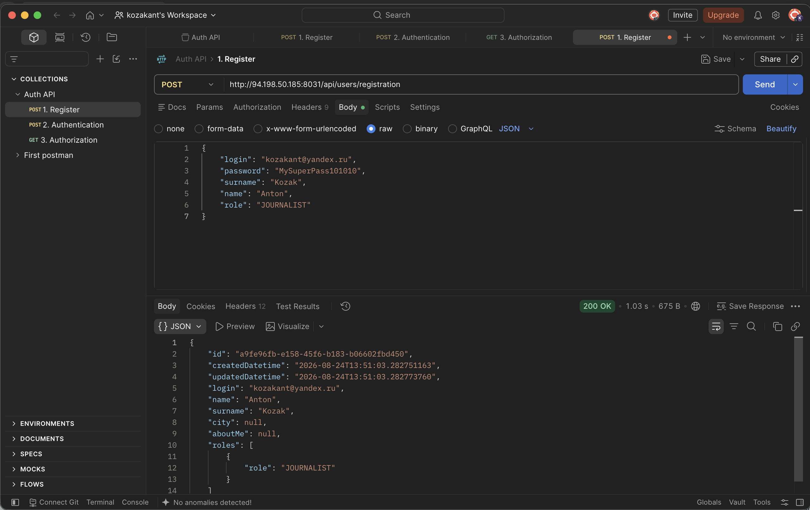
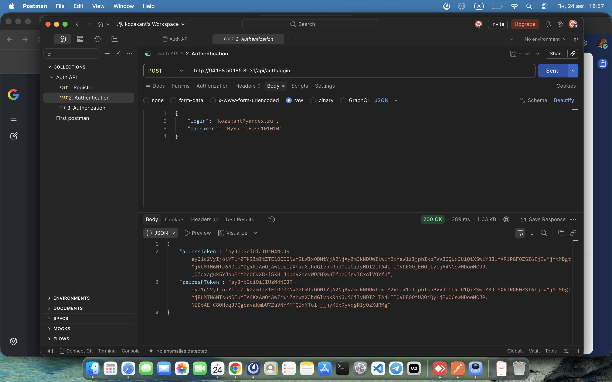
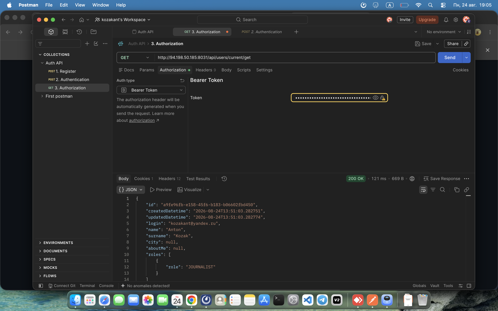

# Тестирование API авторизации в Postman
 
 ДЗ по регистрации, авторизации и получению данных текущего пользователя через API.

## 1. Регистрация нового пользователя (POST)

## 2. Авторизация и получение токена (POST)

## 3. Получение данных текущего пользователя (GET)

